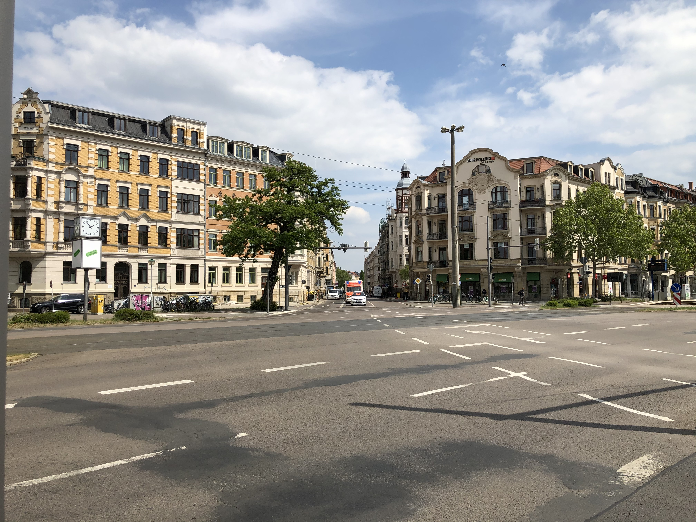
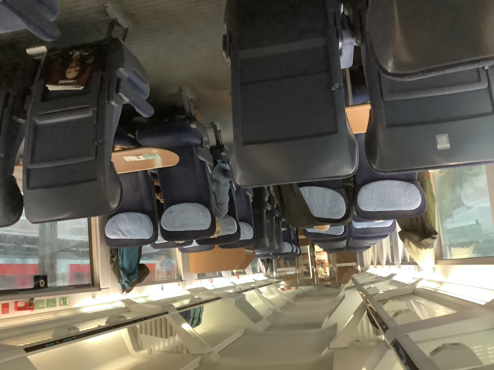
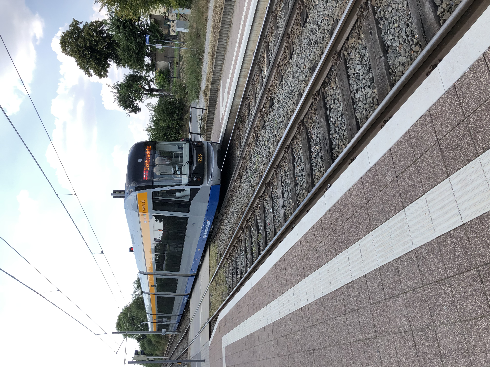
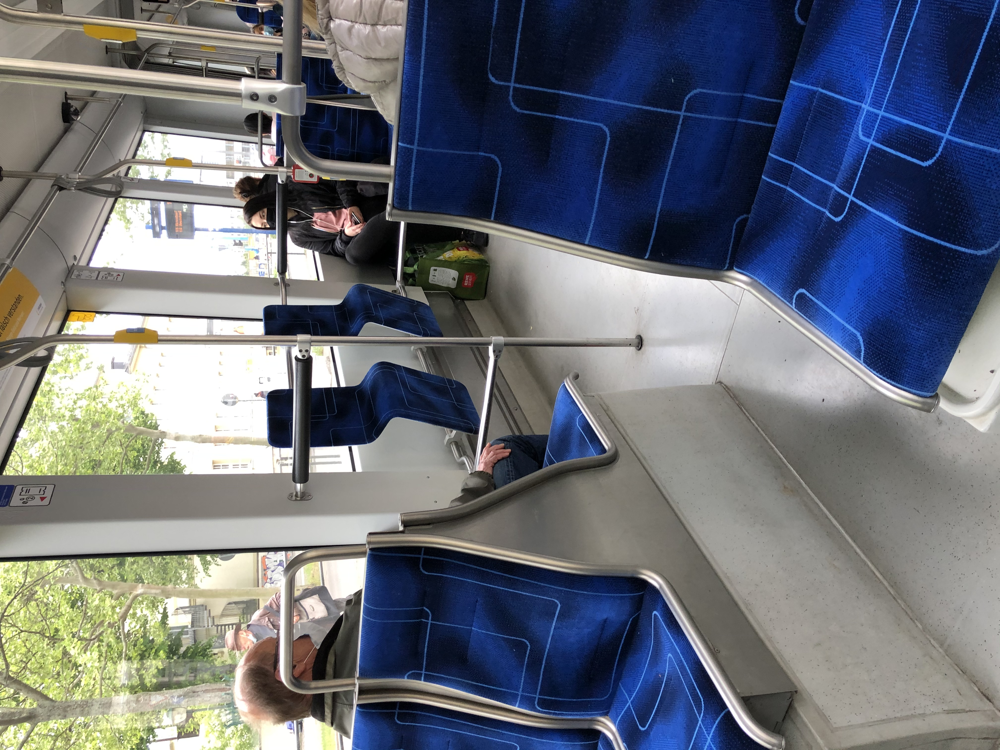
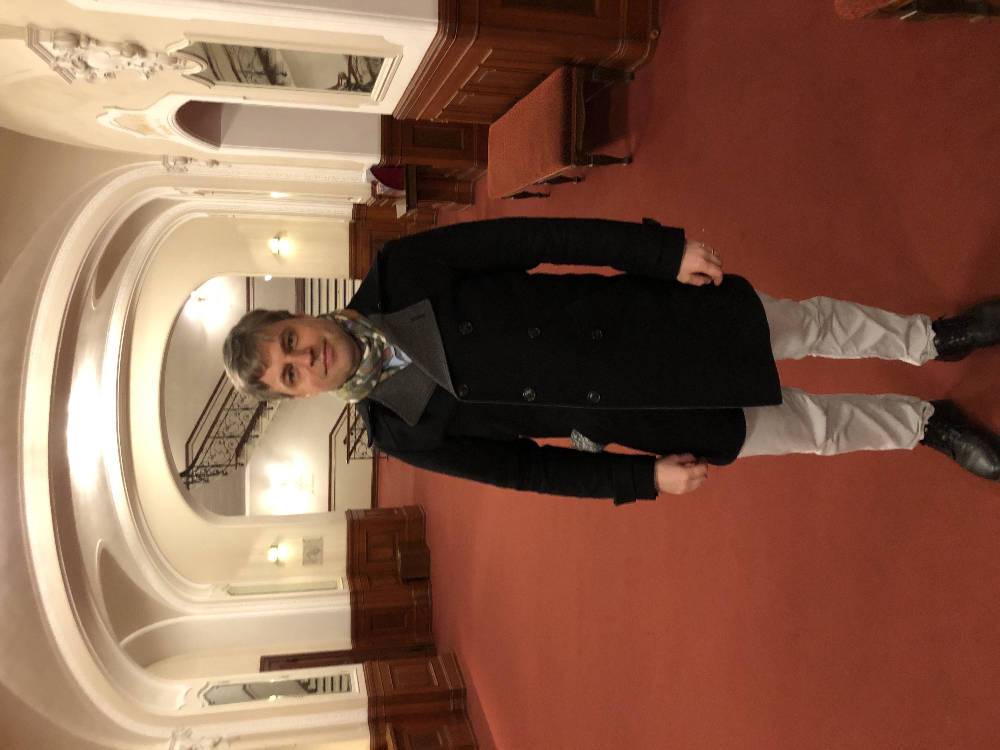
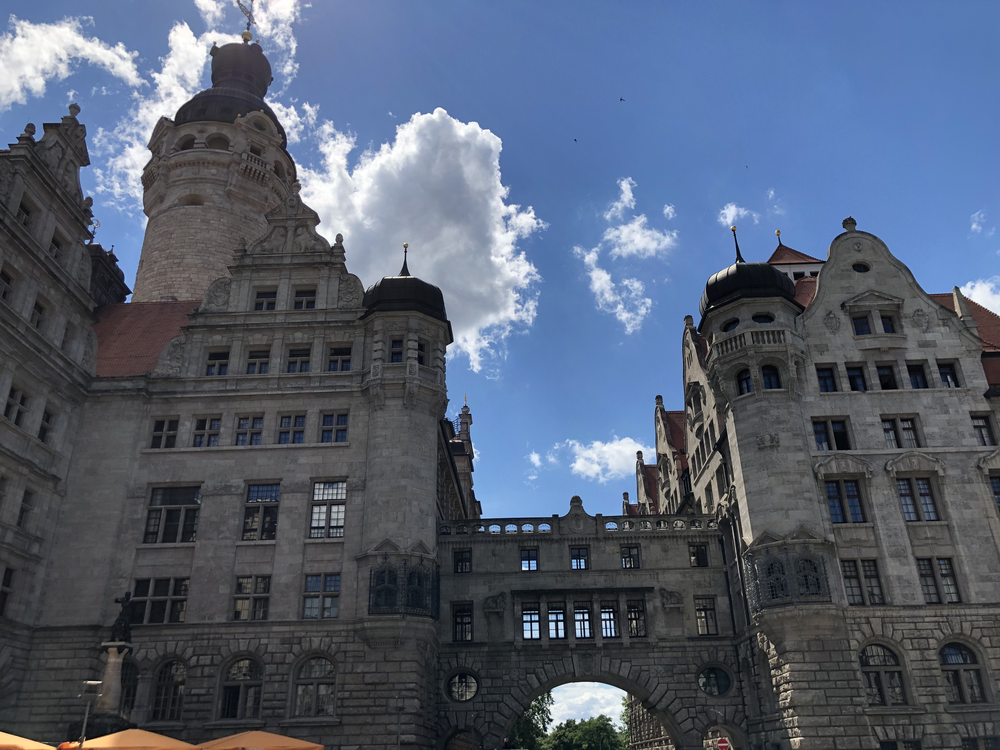
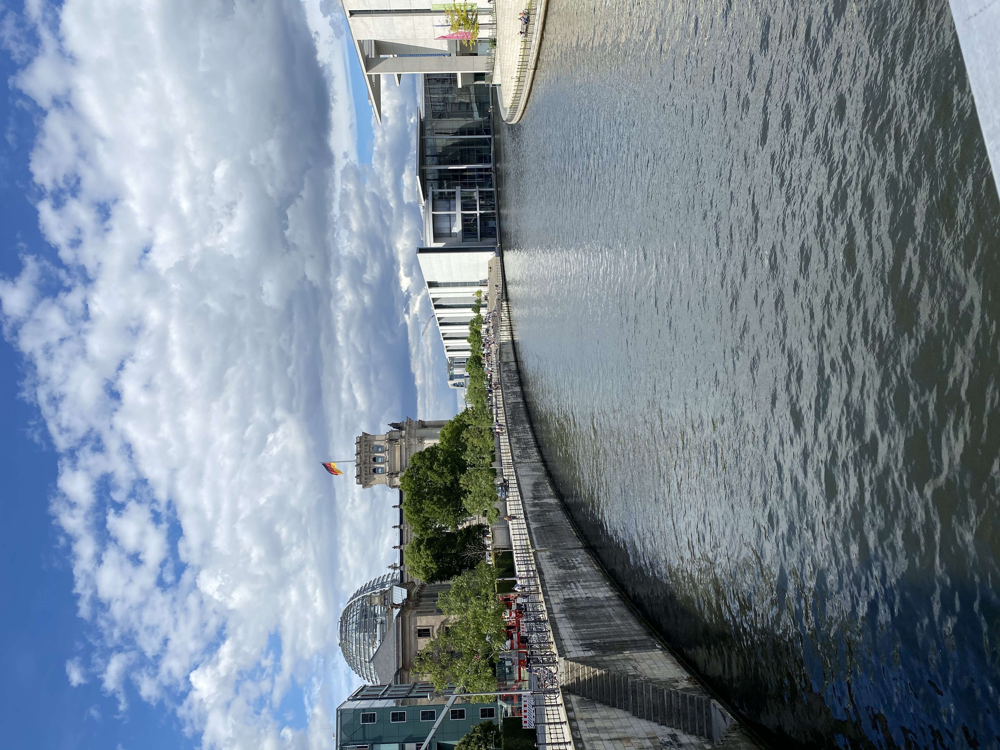
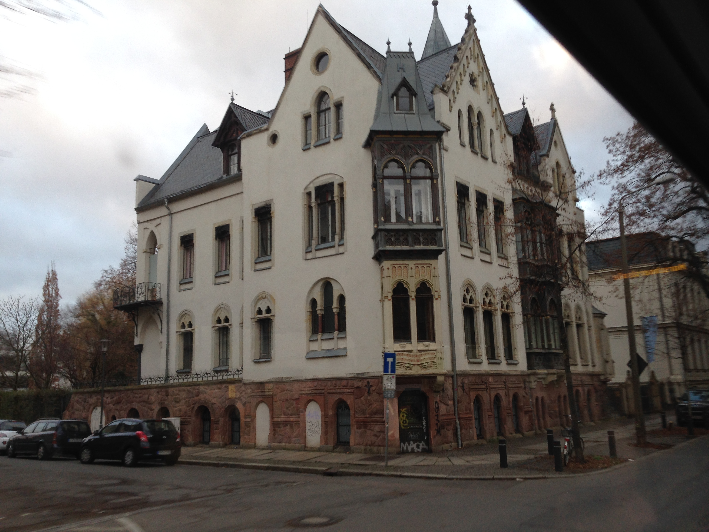
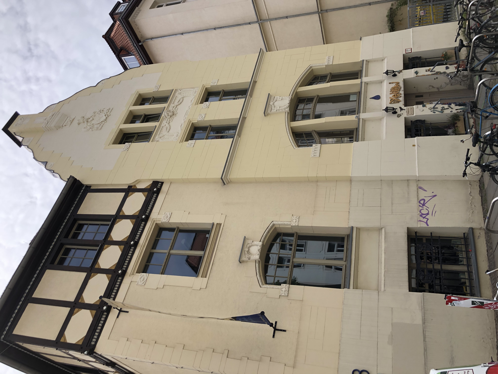

# A few pictures from Leipzig in 2020

I moved into an apartment not far from the center of Leipzig. The neighbor streets look like this.

I needed to take a high-speed train between Hamburg and Leipzig. The train car looked like this.

In Leipzig, I take a streetcar to go to the city center. Streetcars arrive on the minute every 15 minutes and look like this inside and outside. You have to wear a mask inside the streetcar.

In Hamburg, my wife and I went to a concert with some opera music. The lobby of the concert hall looked like this.

There is a park close to my apartment. My wife and I go there quite often, now with the baby.

After a few hours hiking from Leipzig city center, you will find this little castle.

A larger castle is the municipal building where I registered my daughter’s birth.

A botanic garden is close by to my apartment.

A picture from the center of Berlin. This is about an hour's train ride from Leipzig.

Leipzig was relatively untouched during the wars. There are lots of historic buildings like these.

